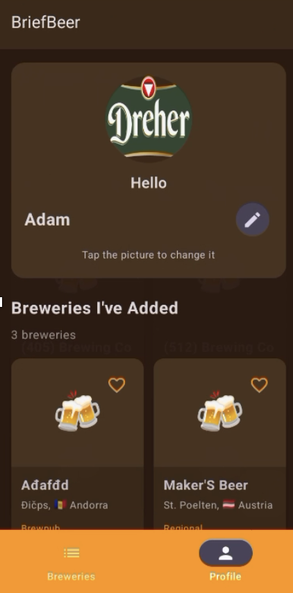

# BriefBeer 🍺

Discover breweries worldwide, keep a personal list of favorites, and track your beer journey with streaks and notes.

- Live site: https://briefbeer.adamtorok.dev
- Android APK (debug): [public/BriefBeer.apk](public/BriefBeer.apk)

## ✨ Features
- Global brewery discovery and search
- Favorite breweries list synced in the app
- Interactive map view of selected breweries
- Daily streak tracker for beer consumption habits
- Optional photo attachments to beers you like
- Simple account management

## 📸 Screenshots

  
  
  

## 🧭 Project Overview
BriefBeer is a mobile-first project focused on helping enthusiasts explore breweries and build a personal beer log. It leverages a global dataset, presents it in a clean UI, and lets users curate their own favorites and habit streaks.

## 🚀 Getting Started (Android)
This repository includes the Android app source under the `code/` directory.

### Prerequisites
- Android Studio (Giraffe or newer recommended)
- JDK 17+
- Android SDK and an emulator or a physical device

### Build & Run
1. Open the `code/` folder in Android Studio.
2. Let Gradle sync.
3. Run the `app` module on your device/emulator.

Or download and install the debug APK: [public/BriefBeer.apk](public/BriefBeer.apk)

## 🌐 Web Preview
A lightweight web landing page is available at: https://briefbeer.adamtorok.dev

## 🧱 Tech Stack
- Android, Kotlin, Jetpack (Compose, ViewModel)
- Room database for local persistence
- Gradle build system

## 🧪 Usability Report
Read the usability testing report: [public/BriefBeer Usability Testing Report.pdf](public/BriefBeer%20Usability%20Testing%20Report.pdf)

## 👥 Authors
- Miloš Karapandžić
- Adam Török

## 📄 License
This project is provided as-is for demonstration and learning. If you plan to reuse or distribute, please open an issue to discuss licensing.

